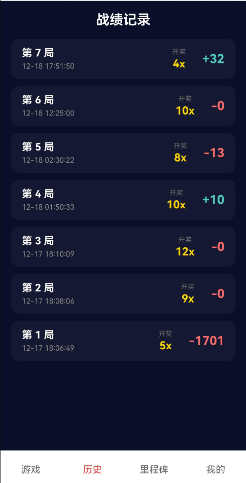

# 鸿运押宝 (FortuneBet)

**中文** | [English](README.md)

<div align="center">
  
  <br>
  <h3>一款基于 ArkTS 构建的刺激的鸿蒙 (HarmonyOS) 模拟押宝游戏</h3>
</div>


---

## 📖 项目概述

**鸿运押宝 (FortuneBet)** 是一款使用 ArkTS 和 ArkUI 开发的鸿蒙 (HarmonyOS) 单机休闲模拟押宝游戏。玩家可以在一个零风险的虚拟环境中体验高倍率博弈的快感。通过在不同赔率的数字上设定筹码，测试你的策略和运气！

本项目展示了一个完整的鸿蒙应用架构，包含了安全的本地数据持久化 (Preferences)、复杂的 UI 状态管理、动画效果以及清晰的业务逻辑分离。

## ✨ 核心特性

* **🎲 刺激的博弈体验:** 采用经典的阶梯式赔率设计。你可以选择高频低倍 (如 2倍, 4倍) 稳扎稳打，也可以追求低频高倍 (如 50倍, 100倍) 搏取大奖。
* **💰 游戏币系统:** 初始赠送免费虚拟游戏币用于立即开始体验。
* **🎁 每日低保/救济金:** 让你永远有翻本的机会！每日首次登录或当余额归零时，系统会自动发放 30 个游戏币的救济金。
* **💾 本地数据持久化:** 所有用户数据、余额、设置和详细的游戏历史记录都安全地存储在本地鸿蒙首选项 (Preferences) 中，无需联网即可畅玩。
* **📈 资产走势图:** 在“我的”页面通过动态的可视化柱状图追踪你最近 10 局的余额变化快照，直观回顾你的博弈之路。
* **🏆 里程碑成就系统:** 随着累计赢得的游戏币增加，解锁不同的成就勋章。
* **⚙️ 完善的个人中心与设置:**
    * 支持自定义昵称、个性签名和游戏头像。
    * 安全的本地密码修改功能。
    * 便捷查看游戏规则、版本信息和开源协议。
* **🎨 沉浸式 UI:** 深色系界面设计，配合动效（如独特的“关于我们”入场动画），提升用户体验。

## 📱 界面截图

<div align="center" style="display: flex; justify-content: center; gap: 10px;">
  
  
  
  
  
</div>


## 🛠️ 快速开始

### 前置要求

* **DevEco Studio:** 版本 6.0 或更高 (兼容 API 12+)。
* **HarmonyOS SDK:** API Version 9 或更高。

### 安装与运行

1. **克隆项目仓库:**

   ```
   git clone https://github.com/XXYoLoong/FortuneBet.git
   ```

2. **在 DevEco Studio 中打开:**
   启动 DevEco Studio，选择 **File -> Open**，然后选择项目根目录。

3. **同步项目:**
   等待 DevEco Studio 下载必要的依赖并同步项目配置 (Gradle sync)。

4. **编译运行:**
   连接鸿蒙真机或启动本地模拟器。点击工具栏上的运行按钮 (▶️) 部署应用。

## 🎮 游戏规则

1.  **下注阶段:** 每一轮游戏有 **60 秒**的倒计时。在此期间，你可以分析赔率并选择一个或多个倍率选项进行下注。
2.  **倍率与概率:**
    * **高风险高回报:** 例如：100倍 (0.1% 概率), 50倍 (0.3% 概率)。
    * **低风险低回报:** 例如：2倍 (10.0% 概率), 4倍 (25.0% 概率)。
3.  **结算机制:** 倒计时结束后，系统根据权重随机开出一个中奖倍率。
    * **中奖:** 如果你押中了开奖数字，获得奖励：`下注额 * 倍数`。
    * **未中奖:** 押注在其他非中奖数字上的本金将被扣除。
4.  **救济金:** 如果你的余额不幸归零，重新进入游戏或等待第二天登录，系统会发放 30 币的救济金。

## 📂 项目结构 (关键文件)

```
entry/src/main/ets/
├── common/
│   ├── constants.ts       // 游戏规则、倍率配置、全局常量定义
│   └── types.ts           // TypeScript 接口定义 (游戏轮次 GameRound, 用户信息 UserProfile 等)
├── pages/
│   ├── Index.ets          // 应用入口，鉴权检查，主 Tabs 布局容器
│   ├── game/              // 游戏主界面 UI 和核心交互逻辑组件
│   ├── history/           // 游戏历史记录列表组件，支持实时更新
│   ├── milestone/         // 里程碑成就追踪组件
│   └── profile/           // 个人中心枢纽、设置菜单、资产走势图、关于页面等
└── services/
    ├── AuthService.ts     // 处理登录、注册和密码管理服务
    ├── GameService.ts     // 管理核心游戏循环、下注状态和结算逻辑
    ├── HistoryService.ts  // 获取和管理往期游戏记录
    ├── StorageService.ts  // 基于 Preferences 的统一本地数据持久化层
    └── ServiceLocator.ts  // 服务初始化和依赖注入定位器
```

## 📄 开源协议 (License)

```

Copyright 2025 Jiacheng Ni

Licensed under the Apache License, Version 2.0 (the "License");
you may not use this file except in compliance with the License.
You may obtain a copy of the License at

   http://www.apache.org/licenses/LICENSE-2.0

Unless required by applicable law or agreed to in writing, software
distributed under the License is distributed on an "AS IS" BASIS,
WITHOUT WARRANTIES OR CONDITIONS OF ANY KIND, either express or implied.
See the License for the specific language governing permissions and
limitations under the License.
```

## 👤 关于作者

* “既见游龙，为何不拜”
* GitHub: [https://github.com/XXYoLoong](https://github.com/XXYoLoong)